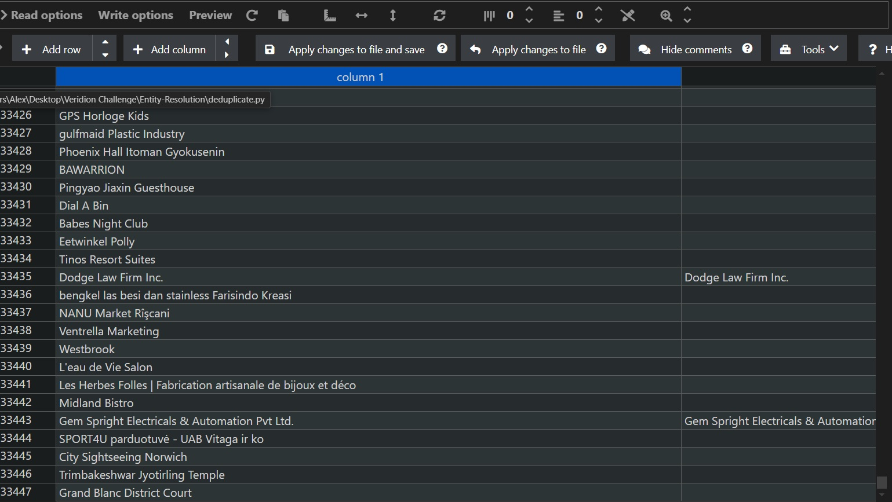
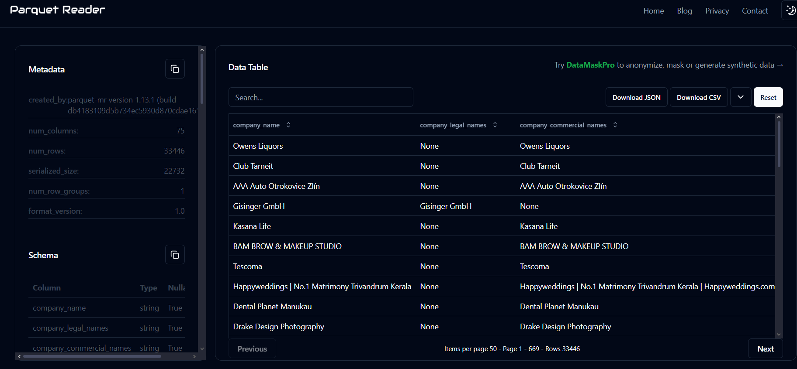
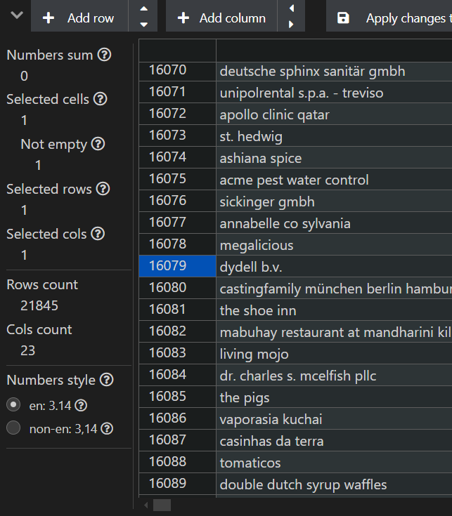

# Entity-Resolution
Veridion Deeptech Engineer Internship Challenge

This project addresses the problem of **entity resolution** — detecting and grouping duplicate records that refer to the same real-world company, even if their data varies slightly. The dataset consists of ~35k companies from different sources, which leads to inconsistencies in names, contact details, and web presence.

The goal was to build a system that assigns a group to each record, ensuring that all entries referring to the same company are grouped together and that the unique companies would be identified.

---
##  Project overview

- Load and normalize company data from `.parquet` using **pandas**
- Select relevant features (name, domain, phone, email, location)
- Preprocess text fields (**lowercase, strip, remove noise**)
- Compute pairwise similarity using **RapidFuzz (token_sort_ratio)**
- Block comparisons by **country + city** to improve performance
- Build graph of similar entries and group using **NetworkX components**
- Pick the most complete company per group as canonical record
---
##  Setup & Dependencies

###  Install required libraries

To run this fuzzy deduplication pipeline, you need the following Python libraries:

####  Core Data Handling
```bash
pip install pandas tqdm
```
###  Fuzzy Matching
```bash
pip install rapidfuzz
```
###  Graph-Based Grouping
```bash
pip install networkx
```
###  reading Parquet files
```bash
pip install pyarrow fastparquet
```
---
##  Project Structure

This project is organized into three main modules, each with a specific role in the fuzzy deduplication pipeline:

###  `parquet_reader.py`


###  `data_processing.py`


###  `deduplicate.py`
---
## Working Process

This section describes each module of the project, the logic behind it, and exactly what was implemented.

###  `parquet_reader.py`

The first thing I encountered was that the dataset was provided in `.parquet` format. Although Parquet is efficient for storage, it's not very convenient when you want to quickly explore or manipulate the data during development.

To work more comfortably, I decided to convert the file to `.csv`. I used `pandas.read_parquet()` and made sure it works with both `pyarrow` and `fastparquet`, so that the script is compatible across environments.

To inspect the `.csv` more easily, I used the **Edit CSV** extension in **Visual Studio Code**, which helped me visually understand the structure and spot inconsistencies.

Additionally, before converting, I used an **online parquet viewer** to double-check that the dataset was loading properly and to preview the schema directly in-browser — just to be sure everything was readable.

> What I did:
- Loaded the `.parquet` file with `pandas.read_parquet()`
- Supported both `pyarrow` and `fastparquet` engines
- Inspected the resulting `.csv` using the Edit CSV extension in VS Code
- Used an online viewer to preview the `.parquet` structure
- Exported the dataset as `veridion_entity_resolution_challenge.csv` for further processing





### `data_processing.py`

Once I had the raw dataset in CSV format, my next goal was to prepare the data for fuzzy matching — and that meant cleaning and normalizing the fields that matter most for deduplication.

I began by selecting only the relevant columns from the full dataset of 75+ fields. I focused on those that best define a company's identity: name, website, phone, email, and location. I also included social media URLs and coordinates as secondary signals.

The core of this module is text normalization. I wrote a function that:
- Converts all text to lowercase
- Strips leading/trailing spaces
- Removes noise using regex (e.g. special characters)
- Normalizes whitespace

This was applied to all object-type fields in the selection. I also specifically cleaned phone numbers by removing `.0` artifacts left from float conversions.

In addition to normalization, I also applied a filtering rule:  
**rows that contained fewer than 3 non-empty key fields** — among `company_name`, `company_legal_names`, `company_commercial_names`, `short_description`, and `website_domain` — were excluded entirely.  
This helped reduce noise and avoid scoring meaningless or unmatchable records. The new normalized csv had 31656 rows of data.

The output of this module is a clean, uniform dataset named `normalized_companies.csv` — ready for fuzzy similarity scoring.

> What I did:
- Selected 22 meaningful columns for entity resolution
- Normalized all textual data (name, email, domain, etc.)
- Cleaned phone numbers and handled missing values
- Filtered out records with too little relevant information
- Saved the result to `normalized_companies.csv`

### `deduplicate.py`

This is the core module of the project — responsible for identifying and grouping duplicate companies using fuzzy logic and graph clustering.

Once the clean, normalized dataset was ready, I avoided comparing every record to every other one (which would be computationally infeasible) by applying a **relaxed blocking strategy**: records were only compared within blocks defined as the first 4 characters of `company_name` + the first 4 of `website_domain`. Additionally, I ensured that all companies sharing the exact same `company_name` were also compared directly.

Each pair was scored using a custom similarity function powered by `RapidFuzz`, combining:
- `company_name`
- `company_commercial_names`
- `website_domain`
- `primary_phone`
- `short_description`

To improve accuracy, I also:
- Added scoring bonuses if companies shared tokens in `domains` or `website_url`
- Gave extra points for overlapping social media links (Facebook, LinkedIn, etc.)
- **Forced a match (score = 100)** when names or domains had very high similarity (≥ 98%) or social URLs were nearly identical

All comparisons scoring above a certain threshold (85) were connected in a graph. Connected components were then interpreted as duplicate groups.

For each group, the most complete record (the one with the most filled-in fields) was selected as the representative.

> What I did:
- Replaced location-based blocking with relaxed character-based blocking
- Ensured all identical names were compared regardless of block
- Designed a scoring function with custom weights and smart bonuses
- Added forced matches when similarity was extremely high
- Built a similarity graph with NetworkX and grouped via connected components
- Selected the most complete entry as the representative
- Exported the results to `all_companies_with_group_id.csv` and `unique_companies.csv`
---
##  Why Fuzzy Deduplication?

From the beginning, it was clear that this dataset came from multiple inconsistent sources, with no unique ID (like tax number or registration code) that could reliably identify a company.

Many company names were almost identical but not quite:
- "Veridion" vs "Veridion Inc."
- "Kronos Group" vs "Kronos"
- "AutoLux SRL" vs "Auto Lux"

In these cases, exact matching would fail — and that’s why I decided to go with **fuzzy deduplication**.

Fuzzy matching allowed me to:
- Handle small differences in spelling, punctuation, and formatting
- Combine multiple fields into a **composite similarity score**
- Catch duplicates that would otherwise be missed by rule-based matching

I used `RapidFuzz` for its performance and flexibility, and built a weighted similarity function across fields like:
- `company_name` (40%)
- `website_domain` (30%)
- `primary_phone` (20%)
- `main_city` (10%)

If two companies scored high enough, they were grouped together using graph-based clustering.

>  Fuzzy deduplication was the best tradeoff between accuracy, flexibility, and simplicity — especially in the absence of clean identifiers and labeled data.

---

###  What alternatives I considered

Before deciding on fuzzy matching, I thought about other options:

####  Exact matching
Comparing fields like `company_name` or `domain` directly using `==`. While fast, it completely fails in cases with even minor variations (e.g. "Veridion Inc." vs "Veridion"). Too rigid for real-world data.

#### Rule-based matching
Writing custom `if` conditions like:
```python
if name == name and city == city and phone == phone:
    group togethe
```
####  Machine learning / supervised classification
I also considered training a machine learning model that could classify whether two rows refer to the same entity.

Although this approach can perform very well, it comes with a major cost: it requires a **large, labeled dataset** of true duplicates and non-duplicates to train on.

---
##  Results & Conclusions

After applying the full fuzzy deduplication pipeline, the dataset was reduced from over **33,000 raw records** to approximately **21,900 unique companies**.

This means the system identified and grouped **thousands of duplicate records**, even when:
- Company names had legal suffixes or slight variations
- Domains differed by subdomains or formatting
- Phone numbers or emails were partially missing
- Location data was incomplete or inconsistent

###  Key Results
- `all_companies_with_group_id.csv`: all 33k+ records, each tagged with a `group_id`
- `unique_companies_after_dedup.csv`: 21,900 canonical companies (1 per group)
- Blocking and weighted similarity scoring provided both scalability and precision



###  Post-validation Observations

To validate the effectiveness of the deduplication pipeline, I used ChatGPT as an independent model to reanalyze potential duplicates.  
The results were generally **satisfying** — most duplicate groups were correctly identified and resolved.

However, upon more detailed inspection using the same model, I also found a few **remaining duplicates** in the `unique_companies_after_dedup.csv` file. These were edge cases where companies had nearly identical names and domains but different locations or minor formatting mismatches.

This reinforces the idea that fuzzy matching alone, while powerful, is not perfect — and some manual or rule-based post-processing may still be needed for production-grade results.

Moreover, it's important to note that different choices in the pipeline could significantly impact the results. For example:
- The selected columns used in the similarity score (e.g., name vs. domain vs. phone)
- The weights assigned to each field
- The similarity threshold (85 in this case)
- How missing or inconsistent fields are handled

A different configuration — such as a lower threshold, additional field normalization, or prioritizing domain over location — could result in fewer or more aggressive groupings.

> In other words, the deduplication outcome is **sensitive to design decisions**, and fine-tuning based on specific business goals or data characteristics is always recommended.

---

###  Final Thoughts

The approach worked well without requiring labeled data, exact identifiers, or strict rules. It was robust to real-world messiness and highly adaptable.

If taken further in a production setting, this pipeline could be extended with:
- Active learning or semi-supervised ML to refine groupings
- Domain-specific override rules (e.g., website match = force group)
- Integration with UI tools for manual validation

> This project shows that even in the absence of perfect data, high-quality deduplication is possible with the right balance of logic, flexibility, and practical engineering.


