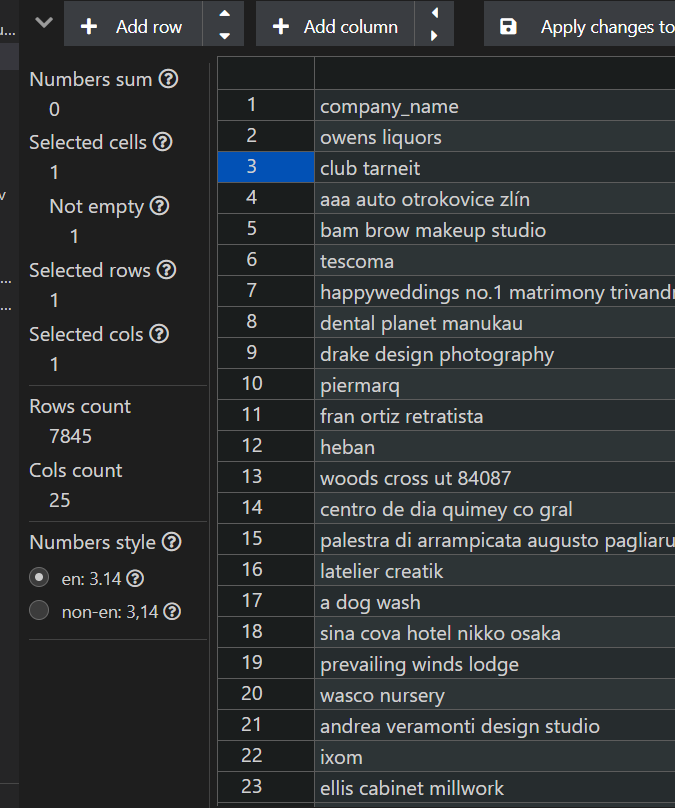

# Entity-Resolution
Veridion Deeptech Engineer Internship Challenge

This project addresses the problem of **entity resolution** — detecting and grouping duplicate records that refer to the same real-world company, even if their data varies slightly. The dataset consists of ~35k companies from different sources, which leads to inconsistencies in names, contact details, and web presence.

The goal was to build a system that assigns a group to each record, ensuring that all entries referring to the same company are grouped together and that the unique companies would be identified.

---
##  Project overview

- Load and normalize company data from `.parquet` using **pandas**
- Select relevant features (name, domain, phone, email, location)
- Preprocess text fields (**lowercase, strip, remove noise**)
- Compute pairwise similarity using **RapidFuzz (token_sort_ratio)**
- Build graph of similar entries and group using **NetworkX components**
- Pick the most complete company per group as canonical record
---
##  Setup & Dependencies

###  Install required libraries

To run this fuzzy deduplication pipeline, you need the following Python libraries:

####  Core Data Handling
```bash
pip install pandas tqdm
```
###  Fuzzy Matching
```bash
pip install rapidfuzz
```
###  Graph-Based Grouping
```bash
pip install networkx
```
###  reading Parquet files
```bash
pip install pyarrow fastparquet
```
---
##  Project Structure

This project is organized into three main modules, each with a specific role in the fuzzy deduplication pipeline:

###  `parquet_reader.py`


###  `data_processing.py`


###  `deduplicate.py`
---
## Working Process

This section describes each module of the project, the logic behind it, and exactly what was implemented.

###  `parquet_reader.py`

The first thing I encountered was that the dataset was provided in `.parquet` format. Although Parquet is efficient for storage, it's not very convenient when you want to quickly explore or manipulate the data during development.

To work more comfortably, I decided to convert the file to `.csv`. I used `pandas.read_parquet()` and made sure it works with both `pyarrow` and `fastparquet`, so that the script is compatible across environments.

To inspect the `.csv` more easily, I used the **Edit CSV** extension in **Visual Studio Code**, which helped me visually understand the structure and spot inconsistencies.

Additionally, before converting, I used an **online parquet viewer** to double-check that the dataset was loading properly and to preview the schema directly in-browser — just to be sure everything was readable.

> What I did:
- Loaded the `.parquet` file with `pandas.read_parquet()`
- Supported both `pyarrow` and `fastparquet` engines
- Inspected the resulting `.csv` using the Edit CSV extension in VS Code
- Used an online viewer to preview the `.parquet` structure
- Exported the dataset as `veridion_entity_resolution_challenge.csv` for further processing


### `data_processing.py`

Once I had the raw dataset in CSV format, my next goal was to prepare the data for fuzzy matching — and that meant cleaning and normalizing the fields that matter most for deduplication.

I began by selecting only the relevant columns from the full dataset of 75+ fields. I focused on those that best define a company's identity: name, website, phone, email, and location. I also included social media URLs and coordinates as secondary signals.

The core of this module is text normalization. I wrote a function that:
- Converts all text to lowercase
- Strips leading/trailing spaces
- Removes noise using regex (e.g. special characters)
- Normalizes whitespace

This was applied to all object-type fields in the selection. I also specifically cleaned phone numbers by removing `.0` artifacts left from float conversions.

In addition to normalization, I also applied a filtering rule:  
**rows that contained fewer than 3 non-empty key fields** — among `company_name`, `company_legal_names`, `company_commercial_names`, `short_description`, and `website_domain` — were excluded entirely.  
This helped reduce noise and avoid scoring meaningless or unmatchable records. The new normalized csv had 31656 rows of data.

The output of this module is a clean, uniform dataset named `normalized_companies.csv` — ready for fuzzy similarity scoring.

> What I did:
- Selected 22 meaningful columns for entity resolution
- Normalized all textual data (name, email, domain, etc.)
- Cleaned phone numbers and handled missing values
- Filtered out records with too little relevant information
- Saved the result to `normalized_companies.csv`


### `deduplicate.py`

This is the core module of the project — responsible for identifying and grouping duplicate companies using fuzzy logic and graph clustering.

Once the clean, normalized dataset was ready, I avoided comparing every record to every other one (which would be computationally infeasible) by applying a **relaxed blocking strategy**: records were only compared within blocks defined as the first 4 characters of `company_name` + the first 4 of `website_domain`. Additionally, I ensured that all companies sharing the exact same `company_name` were also compared directly.

Each pair was scored using a custom similarity function powered by `RapidFuzz`, combining:
- `company_name`
- `company_commercial_names`
- `website_domain`
- `primary_phone`
- `short_description`

To improve accuracy, I also:
- Added scoring bonuses if companies shared tokens in `domains` or `website_url`
- Gave extra points for overlapping social media links (Facebook, LinkedIn, etc.)
- **Forced a match (score = 100)** when names or domains had very high similarity (≥ 98%) or social URLs were nearly identical

All comparisons scoring above a certain threshold (85) were connected in a graph. Connected components were then interpreted as duplicate groups.

For each group, the most complete record (the one with the most filled-in fields) was selected as the representative.

> What I did:
- Replaced location-based blocking with relaxed character-based blocking
- Ensured all identical names were compared regardless of block
- Designed a scoring function with custom weights and smart bonuses
- Added forced matches when similarity was extremely high
- Built a similarity graph with NetworkX and grouped via connected components
- Selected the most complete entry as the representative
- Exported the results to `all_companies_with_group_id.csv` and `unique_companies.csv`
---
## Why Fuzzy Deduplication?

From the beginning, it was clear that this dataset came from multiple inconsistent sources, with no unique ID (like tax number or registration code) that could reliably identify a company.

Many company names were nearly identical but had small variations:
- "Veridion" vs "Veridion Inc."
- "AutoLux SRL" vs "Auto Lux"
- "Kronos Group" vs "Kronos"

In these cases, exact matching would fail  I decided to implement **fuzzy deduplication** after a lot of research.
Fuzzy matching allowed me to:
- Handle small differences in naming, punctuation, or formatting
- Merge information from multiple fields into a **custom similarity score**
- Identify duplicates even when some key data fields were missing or inconsistent

I used `RapidFuzz` to compute token-based similarity between company records, combined with additional rules to improve recall. The similarity function took into account:
- `company_name`
- `company_commercial_names`
- `website_domain`
- `primary_phone`
- `short_description`

To improve the robustness of the matching:
- I added bonus points when companies shared the same social media URLs or domains
- I applied **forced matches** (score = 100) when fields like names or domains were almost identical (≥ 98%)
- I ensured that companies with **identical names** were compared, even if blocking would have excluded them

> Fuzzy deduplication gave me the best balance between accuracy, flexibility, and scalability — especially in the absence of structured IDs or labeled training data.

---

###  What alternatives I considered

Before deciding on fuzzy matching, I thought about other options:

####  Exact matching
Comparing fields like `company_name` or `domain` directly using `==`. While fast, it completely fails in cases with even minor variations (e.g. "Veridion Inc." vs "Veridion"). Too rigid for real-world data.

#### Rule-based matching
Writing custom `if` conditions like:
```python
if name == name and city == city and phone == phone:
    group togethe
```
####  Machine learning / supervised classification
I also considered using a pre-trained semantic similarity model, such as those based on sentence embeddings, to compare company records beyond surface-level text matching.

While this method could potentially lead to more accurate results by capturing deeper context and meaning, it proved to be inefficient in practice given the constraints of my local environment. The model was computationally expensive to run at scale, and not viable for a dataset of this size without cloud resources or significant infrastructure.


---
## Results

After multiple rounds of testing, tuning, and rethinking the matching logic, the final version of the fuzzy deduplication pipeline produced **a strong and reliable result**: the dataset was reduced from over **33000 records** to  **7844 unique companies**.

This significant reduction confirms that the system correctly identified and grouped thousands of duplicate entries — even when data was inconsistent, incomplete, or formatted differently across sources.

### Key Results
- `all_companies_with_group_id.csv`: All companies, each tagged with a `group_id`. Eeach sorted by the `group_id` in ascending order.
- `unique_companies.csv`: 7844 canonical companies (1 per group). Eeach sorted by the `group_id` in ascending order.
- Custom scoring, blocking, and forced matching rules helped capture real duplicates that standard fuzzy logic alone might miss




### Optimization Process

These results were not achieved in one pass. Throughout the process, I tried multiple approaches — including experimenting with:
- Different blocking strategies (`city + country`, relaxed character-based keys)
- Adjusted field weightings and thresholds
- Bonus logic based on domain tokens, website URLs, and social media overlaps
- Forced grouping when high similarity was detected (≥ 98%)

###  Final Thoughts

This is the best solution I was able to produce given the constraints, and it reflects a balance between technical robustness and real-world practicality.

Although there may still be cases where companies were either grouped too aggressively or missed altogether, I believe this approach was significantly more challenging and insightful than simply using pre-trained model to detect duplicates.

Even though pre-trained models represent a more "modern" direction, I preferred to use artificial intelligence as a **support tool**, rather than allowing it to make all the decisions for me. This way, I was still fully engaged in the design process, using AI to validate, test, push my own thinking and learn.  


